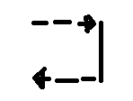
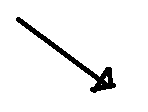
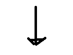

lemon
====


<br>


todo
----
* [ ] multithread::pool 구현
* [ ] concurrent_foward_list 구현
* [ ] dispatcher thread-safe 패치
* [ ] generator 구현

see
----
  * [docs](doc/)
  * [example](example/)

pros
----
* 코드의 흐름과 프로그램의 흐름을 동기화 할 수 있습니다.
 * 이전의 구현
 ```C++
 void pre_heavy_work(){
    printf("begin work\n");
   
    /* ... */

    work_pool.post_heavy_work();
 }
 void post_heavy_work(){
    printf("end work\n");
   
    /* ... */
   
    response();
 }
 ```
 * lemon을 이용하면
 
 ```C++
 void func(){
    printf("begin work\n");
      heavy_work();
    printf("end work\n");
    response();
 }
 ```
* 스케쥴링이 필요할 때, 별도의 스케쥴러가 필요없고 오브젝트 스스로가 자신을 스케쥴링 할 수 있도록 작성할 수 있습니다.

  ```C++
  void object::update(){
    printf("hello update!\n");
  }
  void object::schedule_update(){
    microthread::task([this](){
      while(true){
        delay(frame<60>(1));
        update();
      }
    }).schedule();
  }
  ```
